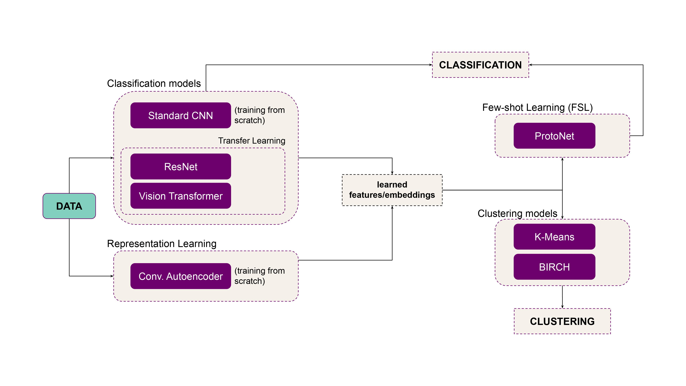

# image_classification_simulation

This project implements a set of tools and models to perform multiclass classification of images.

* Free software: MIT license

## Setup

### Clone the repository:

    git clone https://github.com/mila-aia/image_classification_simulation.git

### Install the dependencies:
(it is strongly recommended to create and/or activate a virtual environment before this step)

    pip install -e .

## Documentation

### Overview of the framework

### Datasets

### Models

#### Simple CNN baseline from scratch:

Simple image classification architecture that is a succession of convolutional layers and max pooling layers. It ends with a fully connected linear layer.
* Implemented in the _ClassicCNN_ class.

#### ResNet baseline with transfer learning:

Pre-trained ResNet18 architecture that is fine-tuned on a new task (dataset).
* Implemented in the _ResNet_ class.

#### Vision transformer (ViT) baseline with transfer learning:

Pre-trained ViT for image classification from HuggingFace, that is fine-tuned on a new task (dataset).

#### Few shot learning

#### Clustering on top of representation learning

## Running the code

### Run the tests
Just run (from the root folder):

    pytest

### Run the code/examples.
Note that the code should already compile at this point.

Running examples can be found under the `examples` folder.

In particular, you will find examples for:
* local machine (e.g., your laptop).
* a slurm cluster.

For both these cases, there is the possibility to run with or without Orion.
(Orion is a hyper-parameter search tool - see https://github.com/Epistimio/orion -
that is already configured in this project)

#### Run locally

For example, to run on your local machine without Orion:

    cd examples/local
    sh run.sh

#### Run on a remote cluster (with Slurm)

First, bring you project on the cluster (assuming you didn't create your
project directly there). To do so, simply login on the cluster and git
clone your project:

    git clone git@github.com:alzaia/image_classification_simulation.git

Then activate your virtual env, and install the dependencies:

    cd image_classification_simulation
    pip install -e .

To run with Slurm, just:

    cd examples/slurm
    sh run.sh

Check the log to see that you got an almost perfect loss (i.e., 0).

#### Run with Orion on the Slurm cluster

This example will run orion for 2 trials (see the orion config file).
To do so, go into `examples/slurm_orion`.
Here you can find the orion config file (`orion_config.yaml`), as well as the config
file (`config.yaml`) for your project (that contains the hyper-parameters).

In general, you will want to run Orion in parallel over N slurm jobs.
To do so, simply run `sh run.sh` N times.

When Orion has completed the trials, you will find the orion db file and the
mlruns folder (i.e., the folder containing the mlflow results).

You will also find the output of your experiments in `orion_working_dir`, which
will contain a folder for every trial.
Inside these folders, you can find the models (the best one and the last one), the config file with
the hyper-parameters for this trial, and the log file.

You can check orion status with the following commands:
(to be run from `examples/slurm_orion`)

    export ORION_DB_ADDRESS='orion_db.pkl'
    export ORION_DB_TYPE='pickleddb'
    orion status
    orion info --name my_exp

### Building docs:

To automatically generate docs for your project, cd to the `docs` folder then run:

    make html

To view the docs locally, open `docs/_build/html/index.html` in your browser.

## YOUR PROJECT README:

* __TODO__
